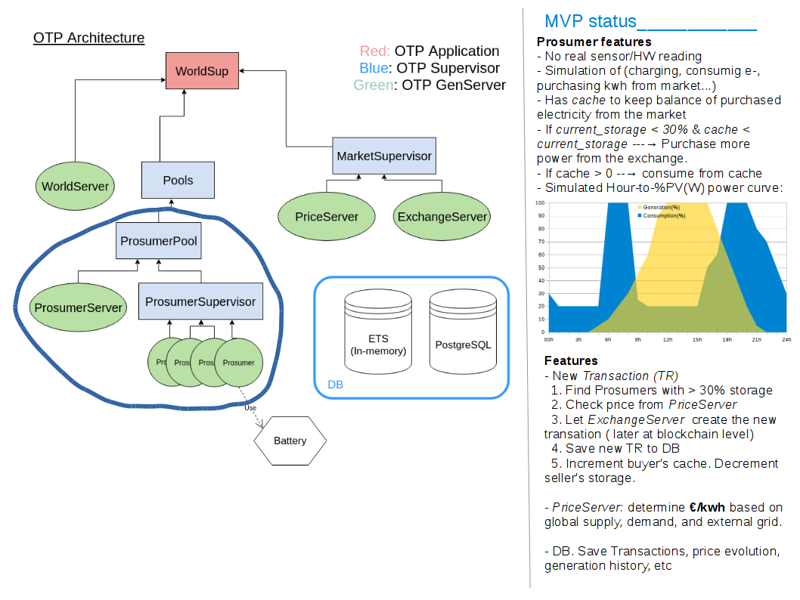

## Prosumer exchange implementation

This is an initial - Elixir/OTP/Phoenix - implementation of the solar prosumer exchange. Simulated [here](https://github.com/git-toni/solar-exchange) for resiliency analysis.

Live version is [here](http://solar-exchange.ml:4000/)

Architecture:

